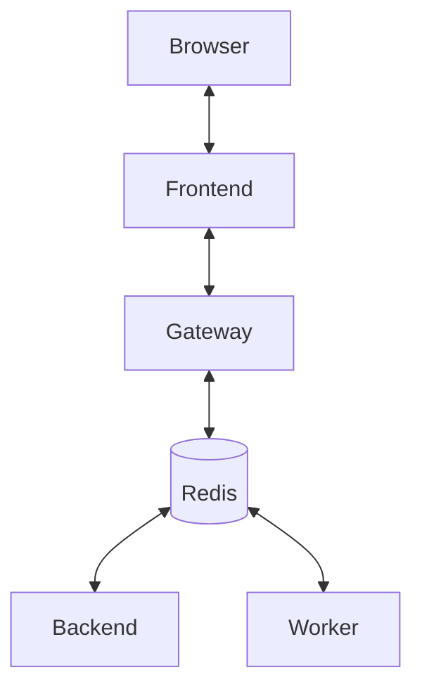

[](https://github.com/ikanher/collatex/actions/workflows/ci.yaml)
AGENTS

## 1) Architect
Role: Define interfaces and constraints before implementation
Deliverables: Spec sections, high-level component integration
Trigger: Major new features or refactors

## 2) Python Backend Agent (Compile Service)
Goal: Expose FastAPI compile service
Tasks:
- Scaffold FastAPI app
- POST /compile → runs Tectonic
- GET /jobs/{id}
- GET /pdf/{id}
- Store job state in memory (MVP), upgrade later
- Log compile output

## 3) Collab Gateway Agent (Node/TS)
Goal: Real-time text sync with Yjs y-websocket
Tasks:
- Basic y-websocket server
- Health check
- Env var config
- Persistence toggle (Redis optional)

## 4) Frontend Agent (React/TS)
Goal: Editor + PDF viewer
Tasks:
- Editor page using CodeMirror 6 + Yjs
- Presence cursors
- PDF.js viewer
- Compile button with status feedback

## 5) QA Agent
Goal: Testing across services
Tasks:
- API unit tests (pytest)
- Load testing for WebSocket
- Frontend E2E test script

## 6) Infra Agent
Goal: Local and CI infrastructure
Tasks:
- Dockerfile per service
- Compose setup
- GitHub Actions (lint, test, typecheck)

## Dev loop
```bash
# Quick start
docker compose up --build
./scripts/smoke.sh
open http://localhost:5173
```
Do **not** open `index.html` directly with `file://`. Always run `npm run dev` or
use the Dockerised frontend at `http://localhost:5173` so CORS and relative paths
work correctly.

## Installing dev deps

```bash
uv pip install -e backend/compile-service[dev]
```

## Running without Docker

```bash
./scripts/dev_local.sh
```

This installs Python and Node deps locally and starts the services with
`COLLATEX_STATE=fakeredis`. Compilation produces a stub PDF unless Tectonic is
installed.

## Architecture


## Authentication

Set `COLLATEX_API_TOKEN` in your `.env` and pass the same value in the frontend
settings dialog. The compile API expects `Authorization: Bearer <token>` and the
WebSocket URL must include `token=<token>`.

`COLLATEX_ALLOWED_ORIGINS` controls which frontend URLs may access the backend.
The default is `http://localhost:5173`. Set it to a comma-separated list of
origins when deploying.

## Rate limits

Each API token may send up to 20 compile requests per hour by default.
Set `COLLATEX_RATE_LIMIT=20` to adjust the limit.

## Troubleshooting

If a compile fails, open the **Build Log** panel under the PDF viewer. It
captures the last part of the Tectonic output so you can spot LaTeX errors.
