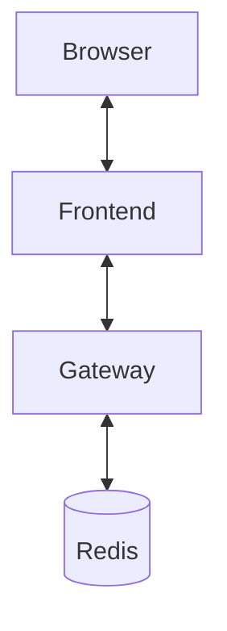

[](https://github.com/ikanher/collatex/actions/workflows/ci.yaml)
AGENTS

## 1) Architect
Role: Define interfaces and constraints before implementation
Deliverables: Spec sections, high-level component integration
Trigger: Major new features or refactors

## 2) Collab Gateway Agent (Node/TS)
Goal: Real-time text sync with Yjs y-websocket
Tasks:
- Basic y-websocket server
- Health check
- Env var config
- Persistence toggle (Redis optional)

## 3) Frontend Agent (React/TS)
Goal: Editor + MathJax preview
Tasks:
- Editor page using CodeMirror 6 + Yjs
- Presence cursors
- Client-side PDF export

## 4) QA Agent
Goal: Testing across services
Tasks:
- API unit tests (jest/vitest)
- Load testing for WebSocket
- Frontend E2E test script

### Running tests

Run all JavaScript test suites with:

```bash
npm test
```

This command executes Vitest and Jest in CI mode so no interactive watchers or prompts block automated runs.

## 5) Infra Agent
Goal: Local and CI infrastructure
Tasks:
- Dockerfile per service
- Compose setup
- GitHub Actions (lint, test, typecheck)

## Dev loop
```bash
# Quick start
cp .env.example .env
docker compose up --build
```
Do **not** open `index.html` directly with `file://`. Always run `npm run dev` or
use the Dockerised frontend at `http://localhost:5173` so CORS and relative paths
work correctly.

## Running without Docker
```bash
./scripts/dev_local.sh
```
Open `http://localhost:5173` and click **New Project**. Share the `/p/<token>`
URL with a second tab to see real-time edits. The editor renders LaTeX directly
in the browser via MathJax and exports PDFs client-side.

### WASM LaTeX (Tectonic)

To enable experimental Tectonic-on-WASM compilation:

1. Run `./scripts/fetch-tectonic-assets.sh` to download the wasm engine and
   local TeX bundle.
2. Set `VITE_ENABLE_WASM_TEX=true` in your `.env`.

When enabled, the **Export PDF** button compiles the current buffer inside a
Web Worker and downloads a PDF without any server dependency. The initial
bundle is lazy-loaded to keep the main app lightweight.

## Architecture


## Security model
The Vite dev server relaxes the Content Security Policy to permit inline scripts and `eval` for tooling like React Refresh. Production builds remain locked down, relying on the strict CSP defined in `apps/frontend/nginx.conf`.

## Security TODO
- Replace the temporary `better-xss` sanitiser with an AST-based policy.
- Harden the Content Security Policy.
- Bring back PDF export once Tectonic-WASM lands.
