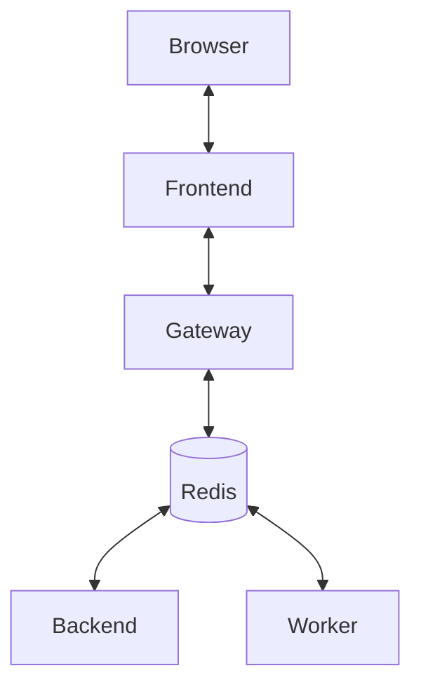

[](https://github.com/ikanher/collatex/actions/workflows/ci.yaml)
AGENTS

## 1) Architect
Role: Define interfaces and constraints before implementation
Deliverables: Spec sections, high-level component integration
Trigger: Major new features or refactors

## 2) Python Backend Agent (Compile Service)
Goal: Expose FastAPI compile service
Tasks:
- Scaffold FastAPI app
- POST /compile → runs Tectonic
- GET /jobs/{id}
- GET /pdf/{id}
- Store job state in memory (MVP), upgrade later
- Log compile output

## 3) Collab Gateway Agent (Node/TS)
Goal: Real-time text sync with Yjs y-websocket
Tasks:
- Basic y-websocket server
- Health check
- Env var config
- Persistence toggle (Redis optional)

## 4) Frontend Agent (React/TS)
Goal: Editor + PDF viewer
Tasks:
- Editor page using CodeMirror 6 + Yjs
- Presence cursors
- PDF.js viewer
- Compile button with status feedback

## 5) QA Agent
Goal: Testing across services
Tasks:
- API unit tests (pytest)
- Load testing for WebSocket
- Frontend E2E test script

### Running tests

Run all JavaScript test suites with:

```bash
npm test
```

This command executes Vitest and Jest in CI mode so no interactive watchers or prompts block automated runs.

## 6) Infra Agent
Goal: Local and CI infrastructure
Tasks:
- Dockerfile per service
- Compose setup
- GitHub Actions (lint, test, typecheck)

## Dev loop
```bash
# Quick start
cp .env.example .env
docker compose up --build
```
Do **not** open `index.html` directly with `file://`. Always run `npm run dev` or
use the Dockerised frontend at `http://localhost:5173` so CORS and relative paths
work correctly.

## Installing dev deps

```bash
uv pip install -e ./backend/compile-service[dev]
```

## Running without Docker

```bash
./scripts/dev_local.sh
```

Open `http://localhost:5173` and click **New Project**. Share the `/p/<token>`
URL with a second tab to see real-time edits. Type LaTeX on the left,
press **Compile** and the PDF iframe reloads on the right.

`dev_local.sh` automatically starts Redis on port 6379 if it's not running. If
the `redis-server` binary is missing, it falls back to an in-process redislite
instance.

## Native run

```bash
# 1. start redis (or brew services start redis)
cd backend/compile-service
poetry install
uvicorn app.main:app --reload
celery -A collatex.tasks worker -Q compile -l info
# then npm run dev in frontend
```

This installs Python and Node deps locally and starts the services. Redis will
be started automatically unless you already have one running. Compilation
produces a stub PDF unless Tectonic is installed.

## Architecture


`COLLATEX_ALLOWED_ORIGINS` controls which frontend URLs may access the backend.
The default is `http://localhost:5173`. Set it to a comma-separated list of
origins when deploying.

## Troubleshooting

If a compile fails, open the **Build Log** panel under the PDF viewer. It
captures the last part of the Tectonic output so you can spot LaTeX errors.

## Realtime status

Clients may follow compile progress via Server-Sent Events. After posting to
`/compile` the response header `Location` includes the job id. Open an
`EventSource` on `/stream/jobs/{id}` and listen for JSON messages of the form
`{"id":"<id>","status":"RUNNING|SUCCEEDED|FAILED"}`. A heartbeat comment is sent
every 100&nbsp;ms to keep proxies happy. Prometheus metrics are exposed at
`/metrics` for monitoring compile counts and durations.

## Live Math Preview
The editor renders LaTeX directly in the browser via MathJax. Set `VITE_USE_SERVER_COMPILE=true` to restore the legacy server compile flow.

## Security model
The Vite dev server relaxes the Content Security Policy to permit inline scripts and `eval` for tooling like React Refresh. Production builds remain locked down, relying on the strict CSP defined in `apps/frontend/nginx.conf`.

## Security TODO
- Replace the temporary `better-xss` sanitiser with an AST-based policy.
- Harden the Content Security Policy.
- Bring back PDF export once Tectonic-WASM lands.
