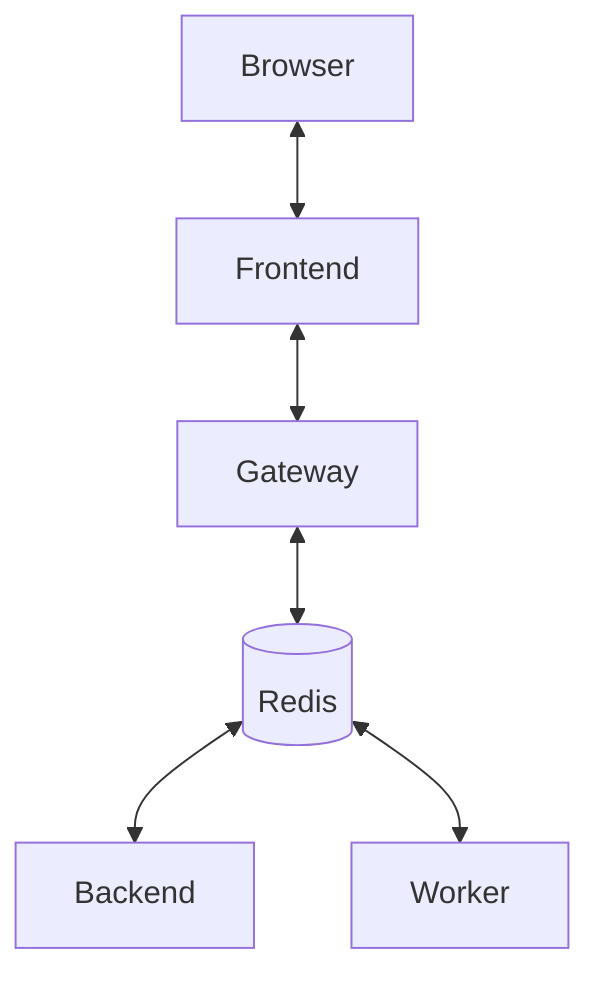

[](https://github.com/ikanher/collatex/actions/workflows/ci.yaml)
AGENTS

## 1) Architect
Role: Define interfaces and constraints before implementation
Deliverables: Spec sections, high-level component integration
Trigger: Major new features or refactors

## 2) Python Backend Agent (Compile Service)
Goal: Expose FastAPI compile service
Tasks:
- Scaffold FastAPI app
- POST /compile → runs Tectonic
- GET /jobs/{id}
- GET /pdf/{id}
- Store job state in memory (MVP), upgrade later
- Log compile output

## 3) Collab Gateway Agent (Node/TS)
Goal: Real-time text sync with Yjs y-websocket
Tasks:
- Basic y-websocket server
- Health check
- Env var config
- Persistence toggle (Redis optional)

## 4) Frontend Agent (React/TS)
Goal: Editor + PDF viewer
Tasks:
- Editor page using CodeMirror 6 + Yjs
- Presence cursors
- PDF.js viewer
- Compile button with status feedback

## 5) QA Agent
Goal: Testing across services
Tasks:
- API unit tests (pytest)
- Load testing for WebSocket
- Frontend E2E test script

## 6) Infra Agent
Goal: Local and CI infrastructure
Tasks:
- Dockerfile per service
- Compose setup
- GitHub Actions (lint, test, typecheck)

## Dev loop
```bash
# Quick start
docker compose up --build
./scripts/smoke.sh
open http://localhost:5173
```

## Architecture

